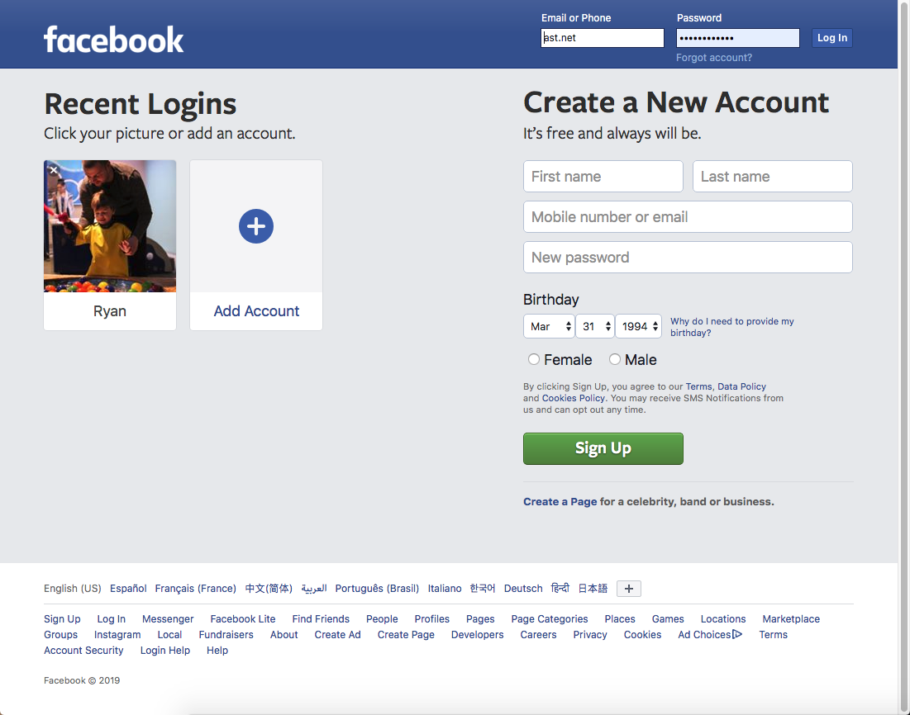
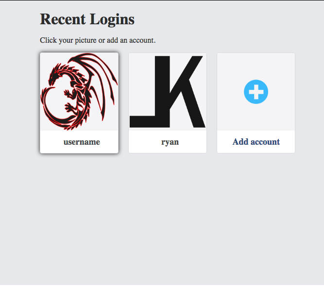
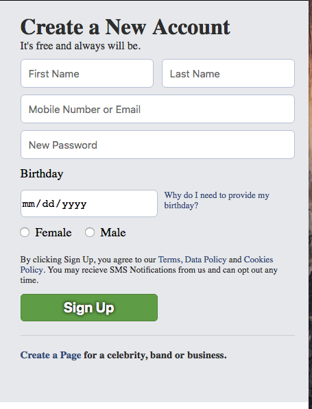

# _Facebook Clone_

#### _This is a clone of the famous https://www.facebook.com, 3/29/19_

#### By _**Ryan McLean**_

## Description

_This is a clone of the famous Facebook. By the time I am done you will be able to log in and user a few features that facebook currently offers. At the moment you can create a account and log in with the first name and password that you set._

## Research

* _Study of https://www.facebook.com_
* _Understanding where all the different components are ex. (header, recent logins, create a account, etc)_

## Setup/Installation Requirements

* _Open your terminal or command prompt and input `cd desktop` then `git clone https://github.com/Lilkgb/javawk3` to install the files onto your desktop._
* _Once downloaded, in terminal type in `cd javawk3` and it will take you into the correct file._
* _Run `npm install` to get all needed dependencies_
* _Run  `touch src/app/api-keys.ts` this will create a file called api-keys.ts. We will need this file soon._
* _This webiste requires you to have a firebase project setup so please go to https://www.firebase.com and signin with your google account then select `Console` in the top right corner_
* _Create a new project. You can set the project name to whatever you want it to be. Accept the terms and click create project_
* _On project overview it should say 'Get started by adding Firebase to your app'. Below that click the circle icon that looks like `</>` and it will open a window. Leave this open for now._
* _Open `Javawk3` folder in any text editor you want to use. I use atom and if you have atom shell commands installed then you can type `atom .` inside your terminal_
* _Find the `api-keys.ts` file that we created. click the src file then the app file and you should see it right there. Click on `api-keys.ts`_
* _Inside this file copy and past this
  `export const masterFirebaseConfig = {
    apiKey: "xxxx",
    authDomain: "xxxx.firebaseapp.com",
    databaseURL: "https://xxxx.firebaseio.com",
    storageBucket: "xxxx.appspot.com",
    messagingSenderId: "xxxx"
  };`_
* _You should have the firebase window open that was giving you the information. If you don't it's ok. Navigate to https://www.firebase.com and click on `Go To Console` in the top right corner. Select your project. Then on Project overview you should see a symbol that looks like this `</>` click it and that window will show up with the information you need_
* _In your api-keys.ts file replace all the `x` with the information that firebase gave you._
* _You may run `npm start` of `ng serve --open` to bring up a live version of the website through your local host_
* _Create a repository for yourself on github or what application you may use_
* _Copy url link thats given and run `git remote add -Your initials- -Link-` inside your terminal_
* _Push your project when ready with `git push -Your initials- -Branch name (master is default)-`_

## Development server

_Run `ng serve` for a dev server. Navigate to `http://localhost:4200/`. The app will automatically reload if you change any of the source files._

## Code scaffolding

_Run `ng generate component component-name` to generate a new component. You can also use `ng generate directive|pipe|service|class|guard|interface|enum|module`._

## Build

_Run `ng build` to build the project. The build artifacts will be stored in the `dist/` directory. Use the `-prod` flag for a production build._

## Running unit tests

_Run `ng test` to execute the unit tests via [Karma](https://karma-runner.github.io)._

## Running end-to-end tests

_Run `ng e2e` to execute the end-to-end tests via [Protractor](http://www.protractortest.org/)._

## Screenshots

#### Original site:

#### Built Site:

_I adjusted the animation that occurs from the original site when you hover one of the recent logins to look more appealing._

_I adjusted the birthday input to a calendar input so it's not three separate inputs but one._

## Completed features

* _User can create a account on the home page_
* _User can log in with the email and password they set up_
* _User can see the feed page (nothing on it yet)_
* _User can select their profile in the header to be taken to their profile page_
* _User can navigate back to the feed by clicking either the facebook icon on the left of the header or clicking 'home' in the header_
* _If the user is logged in from a previous session and they come back to the website it will automatically log them back in and direct them to the feed_

## Features to Completed

* _When user logs out it will display their image and name as a recent user_
* _User will be able to edit their information via the profile page_
* _User will be able to make a post and have it display in the feed_
* _User will be able to see their list of friends via their profile page_

## Known Bugs

_very rarely when a user creates a account their uid that created for their email/password account wont transfer to their information that's held in the database. Super rare occurrence._

## Support and contact details

_Please contact Ryan McLean at rmcleandev@gmail.com_

## Technologies Used

* _HTML_
* _Webpack_
* _Bootstrap_
* _Angular2_
* _Typescript_
* _Firebase_

### License

*This Software is Licensed under the MIT License.*

Copyright (c) 2019 **_Ryan McLean_**
